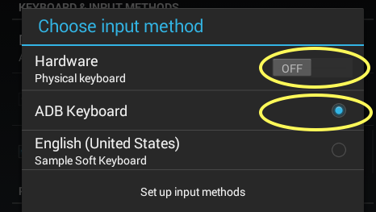

# Auto Script

## 设置要求

1. 夜神模拟器:
   - 自定义分辨率 宽：480，  高：800，   DPI：160
   - 开启root权限
   - 重启
2. 关闭物理键盘（重启模拟器后需要重新关闭）
3. 安装ADB keyboard 并设置为默认输入法

## 操作步骤

1. 安装百度贴吧（ver 9.7.8.0），安装本应用`Aida`；
2. 打开贴吧，登录，在搜索页搜索关键词，再打开`Aida；`
3. 填写话术，更改设置等；
4. 启用悬浮窗；
5. 在请求权限时选择 “永久允许”；
6. 回到贴吧的搜索页，点击悬浮窗，开始脚本的运行。

